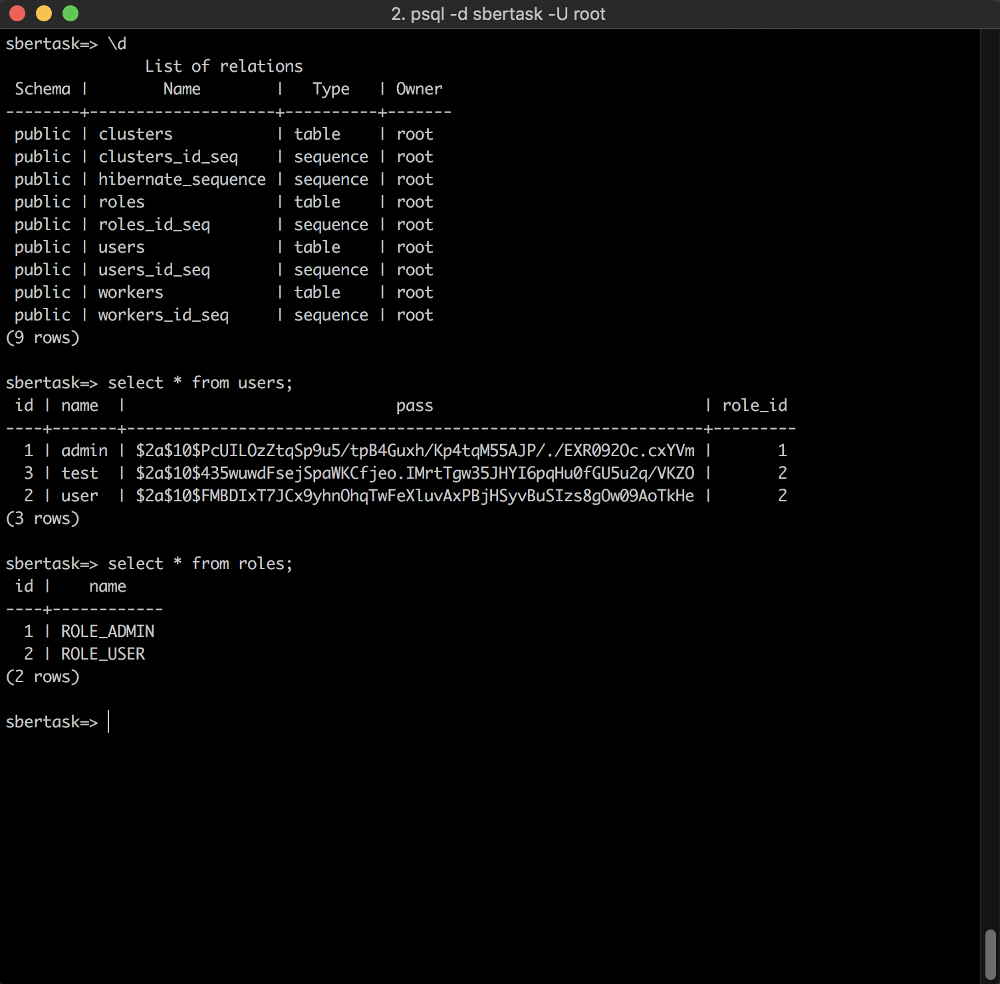
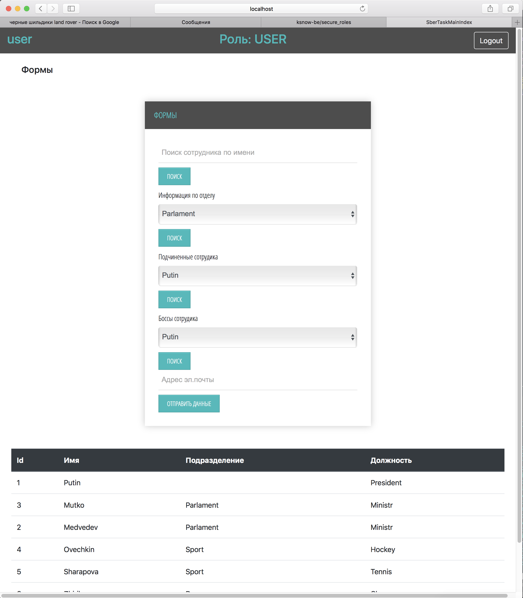
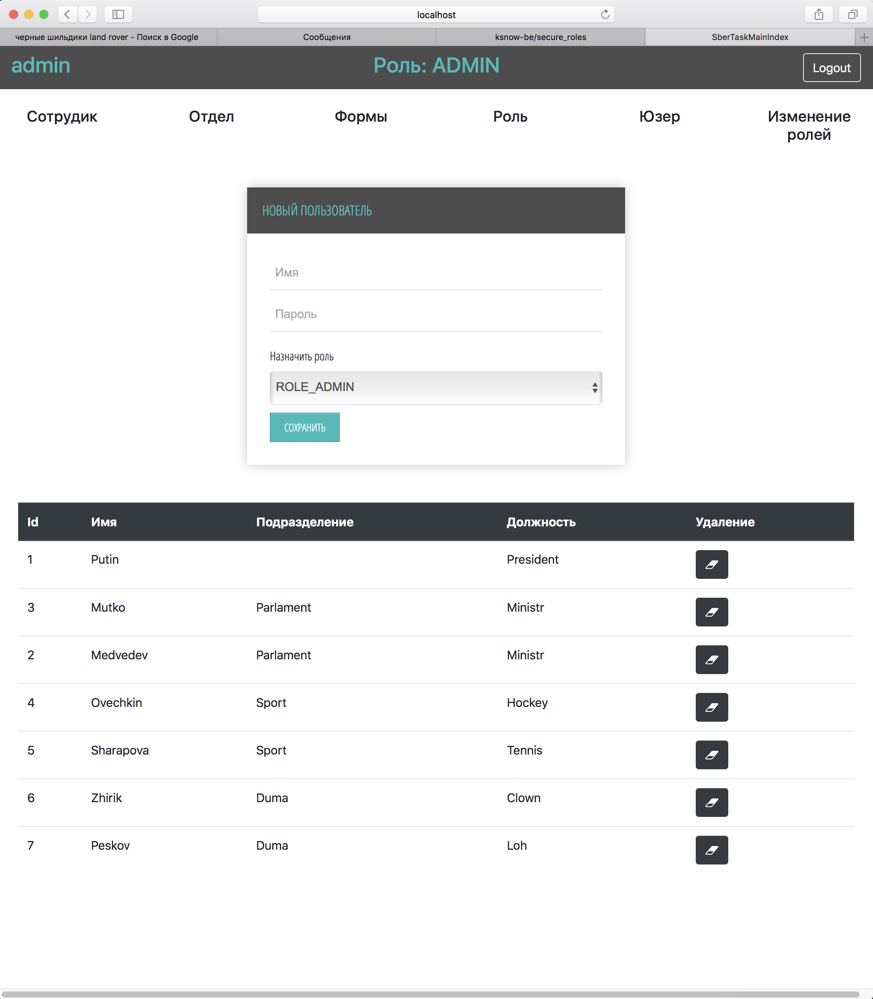
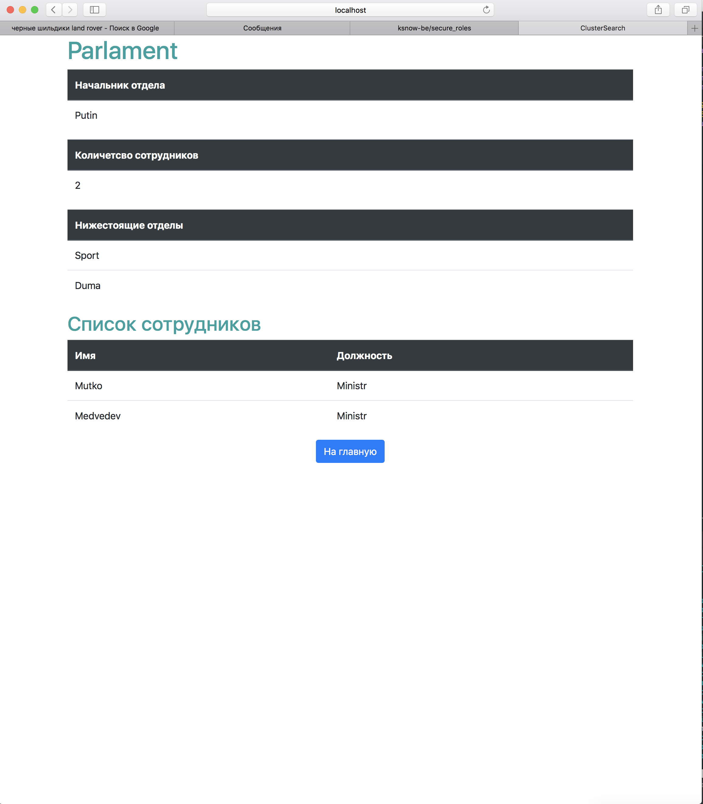
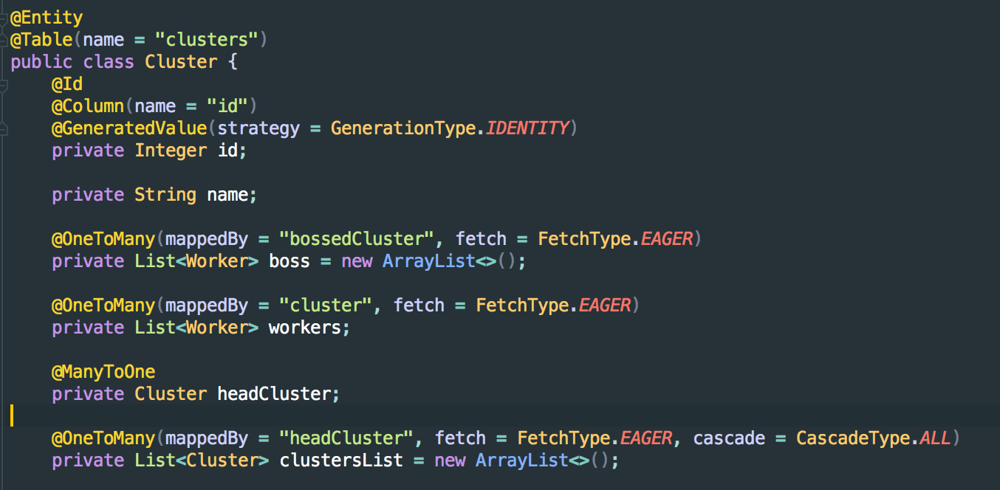

```
 Для начала работы изменить настройки безопасности на PermitAll(), внести 2 роли ["ADMIN","USER"]
```





** После чего вы попадаете на главную страницу с набором возможностей исходя из роли**


****



**Для всех польщователей доступны операции поиска**



**БД - psql, работа через JPA (пример сущности ОТДЕЛ)**


